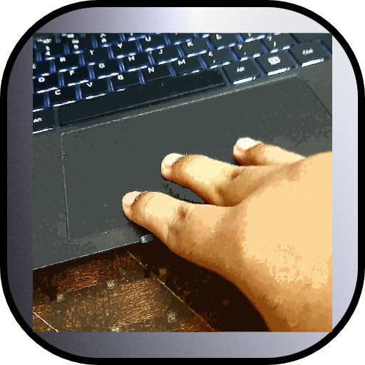

# 3-win-drag

<p align="center">
  
</p>

3-win-drag is a professional Windows background utility that brings true three-finger touchpad window dragging to the desktop with a native, low-latency feel. The application is designed to let users move standard desktop windows from anywhere on screen instead of depending on the title bar, while remaining lightweight enough to stay active for the entire session with minimal overhead.

This repository implements the architecture defined in `SPEC.md` with a Rust application core and a native C++ window-control layer. Rust owns orchestration, input handling, state, configuration, startup integration, tray behavior, and drag logic. C++ owns the direct window-management calls so the runtime can interact with the Windows API through a thin FFI boundary. The result is a background utility that is structured for long-term maintenance rather than a throwaway prototype.

## Product Goals

3-win-drag is built around five non-negotiable goals:

1. The drag experience must feel immediate, stable, and predictable.
2. The application must stay out of the user’s way by running silently in the background with no console window.
3. The runtime must remain efficient enough for continuous use.
4. The codebase must preserve a clean separation between the Rust control plane and the native window-control layer.
5. The project must remain extensible for future gesture, Linux, configuration UI, and deeper platform work.

## Current Delivery Scope

The current implementation is Windows-first and production-oriented.

- Global touchpad input capture is implemented with Windows Raw Input and HID parsing.
- A persistent tray icon is implemented natively on Windows, with `tray-item` retained for non-Windows fallback paths.
- Automatic startup registration is implemented with `auto-launch`.
- Deeper Windows interaction is handled through `winapi`.
- Window preparation and movement are executed through the native C++ backend in `cpp/`.
- The repository is pinned to a Windows GNU Rust toolchain because that is the fully working toolchain validated in this project.

Linux extensibility is preserved in the project structure and design intent, but the shipped application in this repository is currently a Windows desktop utility.

## Implemented Features

- Silent background execution with no visible console window.
- System tray presence using the project logo as the application icon.
- Native Windows settings window for live configuration changes.
- Touchpad templates with vendor-aware first-launch auto-selection and manual switching.
- Three-finger precision touchpad gesture detection.
- Relative window movement based on touchpad centroid movement and an anchor window position.
- Deadzone filtering to suppress jitter from micro-movements.
- Optional smoothing support through a configurable interpolation factor.
- Multi-monitor aware drag movement.
- DPI-awareness bootstrap during process startup.
- Maximized-window restore handling before drag movement begins.
- Full-screen and unsupported window avoidance.
- Minimized-window rejection.
- Automatic startup registration at Windows sign-in.
- Persistent JSON configuration storage.
- Persistent file-based logging for background diagnostics.
- Separate Rust and C++ modules with an FFI bridge.
- Release profile stripping for smaller production binaries.

## Runtime Behavior

At startup the application performs the following sequence:

1. Resolve and create its application data directories.
2. Initialize file logging.
3. Hide any attached console window and run as a background application.
4. Enable DPI awareness for more consistent positioning.
5. Load configuration from disk or create a default configuration on first launch.
6. Synchronize the auto-start setting with the Windows startup registry.
7. Create the tray icon and its menu.
8. Start the raw touchpad input listener.
9. Enter a controller loop that reacts to input events and tray commands.

During a drag session:

1. A three-finger touchpad gesture begins.
2. The current foreground window is validated and, if necessary, restored from maximized state.
3. The original window position becomes the anchor point.
4. Touchpad centroid deltas are converted into screen-space drag movement.
5. Deadzone and smoothing logic are applied before dispatching movement.
6. The native layer moves the target window with `SetWindowPos`.
7. Releasing the three-finger gesture ends the session immediately.

## Architecture

### Rust application layer

The Rust layer is responsible for:

- application startup and lifecycle
- background event loop
- global touchpad HID input capture
- session state and drag logic
- configuration persistence
- logging
- tray interactions
- auto-start management
- fallback behavior when native compilation is unavailable

Primary Rust modules:

- `src/app.rs`: controller loop, drag session state, input orchestration, tray command handling
- `src/config.rs`: configuration schema and application paths
- `src/autostart.rs`: startup registration helpers using `auto-launch`
- `src/tray.rs`: tray icon and menu wiring
- `src/logging.rs`: file-based logger bootstrap
- `src/touchpad.rs`: hidden raw-input window, HID parsing, three-finger gesture detection
- `src/ffi.rs`: native bridge and Windows-facing helpers
- `src/main.rs`: process entry point and fatal startup handling

### Native C++ layer

The C++ layer is intentionally narrow. It exposes a small set of externally callable functions:

- `drag_bootstrap_process`
- `drag_prepare_foreground_window`
- `drag_move_window`
- `drag_window_is_valid`
- `drag_get_cursor_position`

Its responsibilities are:

- inspecting the current foreground window
- rejecting minimized and unsupported windows
- restoring maximized windows before a drag
- keeping full-screen applications out of scope
- returning native window geometry to Rust
- applying window movement quickly through the Windows API

Native source files:

- `cpp/drag.h`
- `cpp/drag.cpp`

## Project Layout

```text
three-win-drag/
├── .cargo/config.toml
├── build.rs
├── Cargo.toml
├── LICENSE
├── README.md
├── logo.png
├── rust-toolchain.toml
├── cpp/
│   ├── drag.cpp
│   └── drag.h
└── src/
    ├── app.rs
    ├── autostart.rs
    ├── config.rs
    ├── ffi.rs
    ├── logging.rs
    ├── main.rs
    ├── touchpad.rs
    └── tray.rs
```

## Configuration

The application stores configuration at:

```text
%LOCALAPPDATA%\solez-ai\3-win-drag\data\config.json
```

Default configuration:

```json
{
  "enabled": true,
  "launch_at_startup": true,
  "touchpad_profile": "balanced",
  "gesture_action": "window_move",
  "gesture_finger_count": 3,
  "touchpad_sensitivity": 1.0,
  "deadzone_pixels": 6,
  "minimum_update_interval_ms": 4,
  "smoothing_factor": 1.0,
  "ignore_fullscreen_windows": true
}
```

Configuration fields:

- `enabled`: master switch for drag behavior
- `launch_at_startup`: controls Windows startup registration
- `touchpad_profile`: saved template/profile identifier shown in the settings UI
- `gesture_action`: `window_move` for direct whole-window movement, `mouse_drag` for native drag-and-drop inside apps
- `gesture_finger_count`: number of simultaneous touch contacts required to begin dragging
- `touchpad_sensitivity`: multiplier applied to the touchpad centroid delta before window movement
- `deadzone_pixels`: ignores tiny gesture shifts that create visible jitter
- `minimum_update_interval_ms`: minimum spacing between tiny movement updates
- `smoothing_factor`: `1.0` means direct movement; lower values apply interpolation
- `ignore_fullscreen_windows`: retains guardrails for games and full-screen applications

If the configuration file becomes invalid JSON, the application preserves a backup as `config.invalid.json` and recreates a valid default configuration.

## Tray Menu

The tray menu exposes operational controls appropriate for a background utility:

- Enable dragging
- Disable dragging
- Enable auto start
- Disable auto start
- Open settings
- Open data folder
- Open log folder
- Exit

The tray icon uses the project logo resource generated from `logo.png`.

## Settings Window

The app includes a native Windows settings window so users can tune behavior without editing JSON manually or leaving the desktop application experience.

- Open it from the tray menu with `Open settings`
- The window reuses the application icon and opens as a normal desktop window
- On a fresh install, the app auto-detects the laptop and starts with the closest available template
- Changes apply live while the app is running
- Template application writes the config file and updates the running app

The settings window exposes:

- action mode selection between `window_move` and `mouse_drag`
- sensitivity, deadzone, smoothing, and update interval controls
- finger-count and fullscreen-ignore options
- touchpad templates for common laptop families and touchpad vendors
- hardware detection and a recommended template based on manufacturer/model/touchpad identity

## Windows Gesture Note

Windows Precision Touchpad systems may already have operating-system-level three-finger gestures assigned to task switching, search, or virtual desktops. 3-win-drag reads the touchpad at the raw HID layer, but if the built-in Windows gesture mappings interfere on a specific laptop, disable or reduce the stock three-finger touchpad gestures in Windows settings so 3-win-drag can own that gesture consistently.

## Build Toolchain

This repository is configured to build with:

- Rust toolchain: `stable-x86_64-pc-windows-gnu`
- Target: `x86_64-pc-windows-gnu`
- C++ compiler: MinGW `g++`
- Windows resource compiler: `rc.exe`

Why the GNU toolchain is pinned:

- it is fully functional in the validated build environment for this repository
- it allows the native C++ layer to compile cleanly with the available Windows GNU C++ toolchain
- it avoids a hard dependency on MSVC build tools in environments where only MinGW is available

If you want to move the project to MSVC later, install Visual Studio Build Tools with the C++ workload, update `rust-toolchain.toml`, and adjust `.cargo/config.toml` as needed.

## Build and Run

### Debug build

```powershell
cargo build
```

### Release build

```powershell
cargo build --release
```

### Run the release executable

```powershell
.\target\x86_64-pc-windows-gnu\release\3-win-drag.exe
```

The executable is built as `3-win-drag.exe`.

Note on Cargo naming:

- Cargo package names cannot start with a digit.
- The internal package name is therefore `three-win-drag`.
- The produced binary name remains `3-win-drag`, which matches the intended product identity.

## Cargo and Build Configuration

The project includes the requested production-oriented configuration:

- package metadata in `Cargo.toml`
- stripped release binaries through `[profile.release] strip = true`
- Windows subsystem linker arguments through `.cargo/config.toml`
- the requested ecosystem crates:
  - `tray-item`
  - `auto-launch`
  - `winapi`

Additional build behavior:

- `build.rs` converts `logo.png` into an `.ico` file during compilation
- `build.rs` embeds the icon as a Windows resource for tray usage
- `build.rs` compiles the C++ backend and exposes it to Rust through FFI

## Logging and Diagnostics

Log file location:

```text
%LOCALAPPDATA%\solez-ai\3-win-drag\data\logs\3-win-drag.log
```

The log is intended for background diagnostics because the application deliberately avoids showing a console window. It records lifecycle events such as startup, configuration state, and drag-session creation.

## Window Handling Details

The drag engine is opinionated about what it should and should not move.

Supported behavior:

- standard visible desktop windows
- foreground windows on single- or multi-monitor setups
- restored maximized windows that can be transitioned into a drag state

Rejected or guarded contexts:

- minimized windows
- full-screen or likely borderless full-screen windows
- unsupported windows that fail geometry or monitor inspection

Maximized window handling:

- the window is restored first
- a temporary placement adjustment keeps the restored window near the user’s cursor
- the drag session then continues from the restored geometry

## Performance Design

Performance-sensitive choices in this implementation include:

- event-driven global input instead of polling loops
- no blocking work inside the drag update path beyond essential native calls
- deadzone filtering for noise suppression
- configurable update interval limits for tiny movements
- a minimal native ABI surface
- release-time stripping for smaller production binaries

## Auto-Start Behavior

Startup registration is handled programmatically through `auto-launch`. On Windows the crate manages the relevant startup registry entries and reflects current-user startup state. The application defaults to enabling auto-start on first run, and the tray menu can enable or disable that behavior later.

## Security and Operational Considerations

3-win-drag is a background system utility. That means operational discipline matters:

- It observes global input events.
- It writes startup settings when auto-start is enabled.
- It writes logs and configuration to the user profile.
- It intentionally avoids moving full-screen windows to reduce interference with games and immersive applications.

The project does not inject into other processes, does not patch system files, and does not require elevated privileges for the normal current-user startup path.

## Known Limitations

- The current shipping implementation is Windows-focused.
- Three-finger gesture quality depends on the Windows Precision Touchpad report format exposed by the laptop firmware.
- The tray UI is intentionally compact and action-oriented rather than a full settings surface.
- Some highly customized or protected application windows may not behave like normal overlapped desktop windows.

## Future Directions

The codebase is intentionally structured so later work can extend it without rewriting the core:

- richer trigger-key and sensitivity configuration from the tray
- dedicated settings UI
- Linux backend implementation
- lower-level gesture integration
- per-application ignore lists
- more advanced smoothing profiles
- installer and signed distribution packaging

## Verification Performed

This repository has been verified locally with:

- `cargo build`
- `cargo build --release`
- direct launch of the release executable to confirm the background process starts successfully

Validated output:

- `target\x86_64-pc-windows-gnu\release\3-win-drag.exe`

## Creator

**Samin Yeasar**

- GitHub: https://github.com/solez-ai
- X: https://x.com/Solez_None
- Portfolio: https://solez.vecel.app

## License

This project is released under the MIT License. See [`LICENSE`](LICENSE) for the full text.
